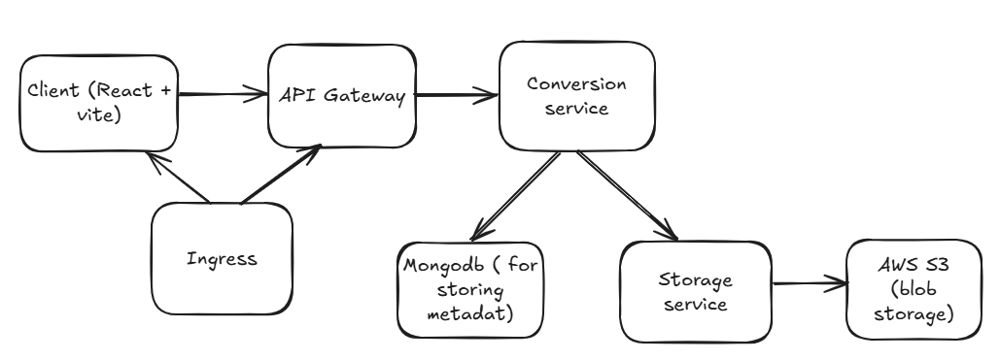

# Word-to-PDF Converter Microservices Architecture

## Overview
This repository contains a Word-to-PDF converter application built using a microservices architecture. The application allows users to upload Word documents, optionally password-protect the generated PDFs, and download the converted files. The architecture ensures scalability, modularity, and ease of deployment using Kubernetes.

### Features
- Upload Word documents for conversion to PDF.
- Optionally add password protection to generated PDFs.
- Store and retrieve converted PDFs from AWS S3.
- Manage metadata using MongoDB.
- Deployable on Minikube or EKS using Kubernetes manifests.

## Tech Stack
### Frontend
- **React** + **Vite**: Provides a fast and responsive UI for uploading documents and managing the conversion process.

### Backend
- **Microservices**:
  - **API Gateway**: Routes requests to appropriate backend services.
  - **Conversion Service**: Core logic for converting Word documents to PDFs.
  - **Storage Service**: Stores generated PDFs in AWS S3 and provides a downloadable link.
  
- **MongoDB**: Used for storing metadata about uploaded and generated files.
- **Docker**: Containerizes all services for consistency and portability.

### Infrastructure
- **Kubernetes**: Manages deployment, scaling, and networking of services.
- **AWS S3**: Stores the converted PDF files.
- **Kubernetes Manifests**: Automates the deployment of all components.

### Bash Scripts
- **create-k8s-config.sh**: Automates the creation of Kubernetes ConfigMaps and Secrets for the application.
- **deploy.sh**: Streamlines the deployment of Kubernetes manifests, ensuring all resources are applied in the correct order.

### Environment Configuration
- **.env File**: Centralized location for environment-specific configurations. This file contains sensitive information (e.g., API keys) that should not be hardcoded into scripts or source code.

---

## Architecture Diagram


---

## How It Works

### Frontend
- A user uploads a Word file via the React-based frontend.
- The user can optionally specify a password for the PDF.

### API Gateway
- Routes incoming HTTP requests to the appropriate backend service based on the endpoint.

### Conversion Service
- Handles the logic for converting Word files to PDF.
- Applies optional password protection to the generated PDFs.

### Storage Service
- Uploads the generated PDFs to an AWS S3 bucket.
- Stores metadata about each file in MongoDB.
- Returns a downloadable link to the client.

---

## Kubernetes Deployment
The application is fully containerized and deployable on Kubernetes. Below are the deployment details:

### Kubernetes Resources
- **MongoDB StatefulSet**:
  - Persistent storage for MongoDB to ensure data integrity.
  
- **Deployments**:
  - **API Gateway**: Handles routing and request forwarding.
  - **Conversion Service**: Converts Word files to PDFs.
  - **Storage Service**: Manages file storage and metadata.
  - **Frontend**: React + Vite application.

- **Services**:
  - Each service has a corresponding Kubernetes `Service` for internal/external communication.
  - Frontend and API Gateway are exposed via `NodePort` for external access.

### Deployment Instructions
1. **Ensure Kubernetes is running**:
   - Install Minikube or connect to an EKS cluster.

2. **Set Up Configuration**:
   - Use `create-k8s-config.sh` to create the necessary ConfigMaps and Secrets:
     ```bash
     ./create-k8s-config.sh
     ```

3. **Apply Kubernetes manifests:**:
   - Use `deploy.sh` to apply all Kubernetes manifests:
     ```bash
     kubectl apply -f kubernetes-manifest.yaml
     ```

4. **Access the Application**:
   - Frontend is available at `http://<Node-IP>:30001`.
   - API Gateway is available at `http://<Node-IP>:30000`.

---

## Environment Variables
The following environment variables are used across the services:

### ConfigMap (`app-config`)
- `AWS_BUCKET_NAME`: Name of the AWS S3 bucket.
- `MONGO_URI`: MongoDB connection string.

### Secrets (`app-secrets`)
- `AWS_ACCESS_KEY_ID`: AWS access key.
- `AWS_SECRET_ACCESS_KEY`: AWS secret access key.

---

## Docker Images
- **Frontend**: `nishchayveer/word-to-pdf-client:latest`
- **API Gateway**: `nishchayveer/word-to-pdf-gateway:latest`
- **Conversion Service**: `nishchayveer/word-to-pdf-conversion:latest`
- **Storage Service**: `nishchayveer/word-to-pdf-storage:latest`

---


